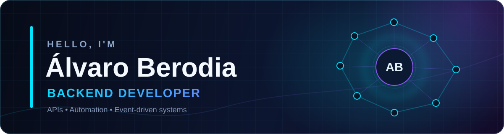
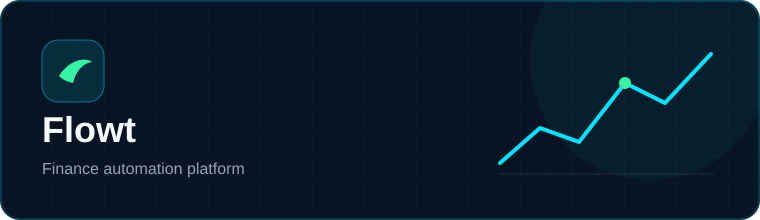
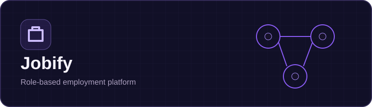
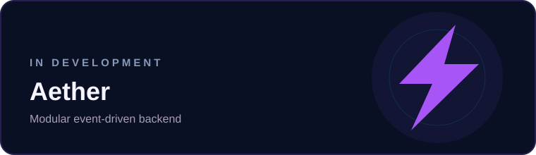
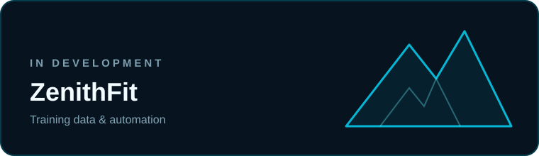

  

  <a href="https://www.linkedin.com/in/%C3%A1lvaro-berodia-gonz%C3%A1lez-82780830b">LinkedIn</a>
  &nbsp;·&nbsp;
  <a href="mailto:aberodiag@gmail.com">Email</a>

## About me

Backend developer from Cantabria, Spain, focused on **APIs, automation and event-driven systems**.

I currently work with **Symfony, API Platform, FastAPI, Docker and SQL databases**, while studying Computer Engineering at UNED. I also hold a Higher Technician degree in Web Application Development.

I enjoy turning everyday problems into software I actually use, with special attention to maintainability, security and data integrity.

## Featured work

Personal finance platform that transforms bank notifications from Gmail into structured movements and financial insights.

**React · TypeScript · Python · Firebase · Gmail API · Gemini**

Employment platform with role-based access, job applications, notifications, chat and a containerized development environment.

**Laravel · React · MySQL · Docker · Nginx**

## In the lab

Modular backend connecting several personal applications through shared authentication, events and platform services.

**Laravel · PostgreSQL · Redis · Docker**

Fitness tracking PWA with offline support, workout analytics, automated integrations and an MCP interface.

**React · Firebase · Vitest · GitHub Actions · MCP**

## Toolbox

